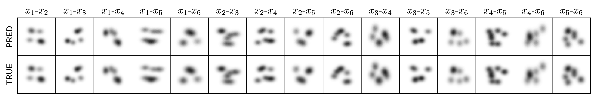

# N-dimensional MENT via particle sampling



Source code for the manuscript "N-dimensional maximum-entropy tomography via particle sampling".


## Setup

Install packages from PyPi and GitHub in conda environment:
```
conda env create --file environment.yaml
conda activate paper-ment
```


